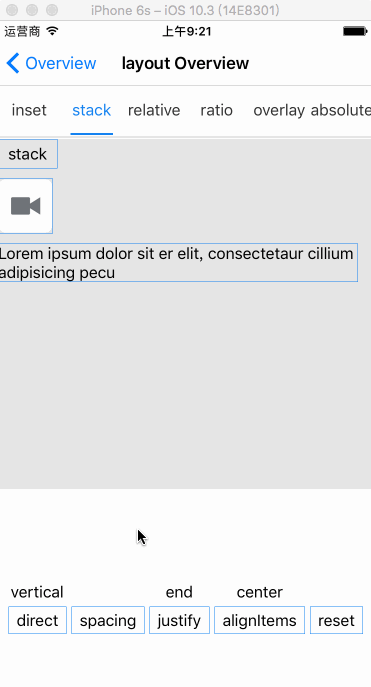
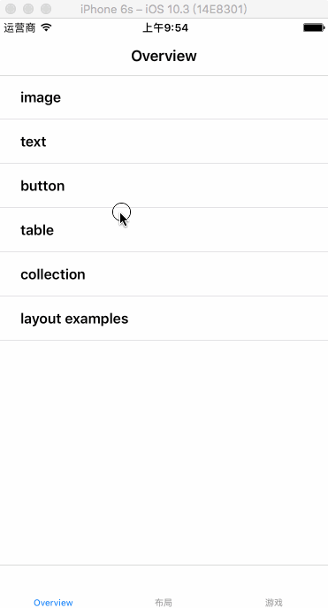

# ASDK_demo
This is a demo about how to use ASDK(AsyncDisplayKit / Texture) [中文介绍](./ASDK_demo/Document/document_chs.md)

### Overview

- image
- Text
- Button
- Table
- Collection

### Layout

- Inset
- Stack
- Relative & center
- Ratio
- Overlay & background
- Absolute

### Games

- Waiting

